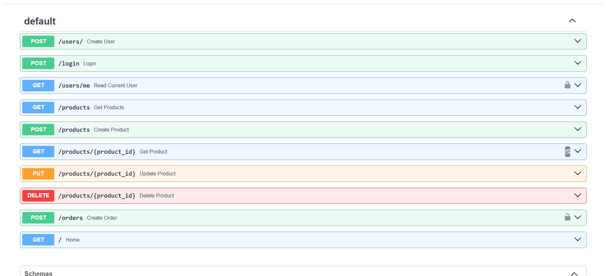
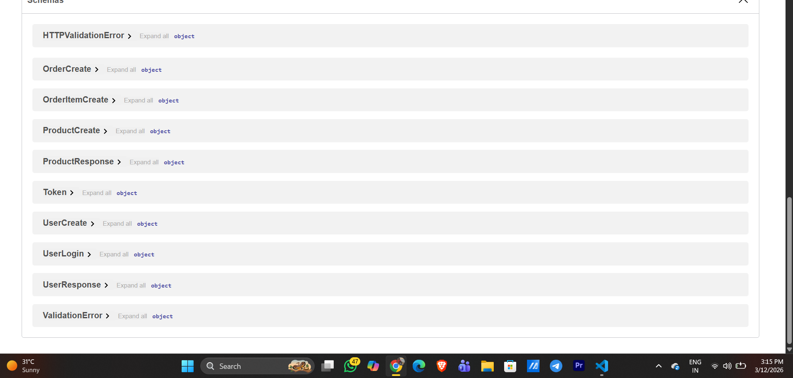

# Ecommerce Backend API

Ecommerce Backend API

A backend REST API for a simple ecommerce system built using FastAPI and SQLAlchemy.

This project demonstrates backend development concepts such as authentication, database relationships, and REST API design.

Features :

1. Authentication

   User registration

   Secure password hashing

   JWT-based login authentication

   Protected API routes

2. Product Management

   Create products

   Retrieve all products

   Retrieve a specific product

   Update product details

   Delete products

3. Order System

   Create orders

   Multiple items per order

   Inventory management (stock reduction)

   User-specific orders

4. Tech Stack

   FastAPI

   SQLAlchemy

   SQLite

   Pydantic

   JWT Authentication

   Python

5. Project Structure:

ecommerce-backend
│
├── app
│ ├── routers
│ │ ├── users.py
│ │ ├── products.py
│ │ └── orders.py
│ │
│ ├── models.py
│ ├── schemas.py
│ ├── database.py
│ ├── security.py
│ ├── dependencies.py
│ └── main.py
│
├── requirements.txt
└── README.md

6. Database Schema :

A. Users:

id
name
email
hashed_password

B. Products

id
name
description
price
category
stock

C.Orders

id
order_id
product_id
quantity

7. API Endpoints

Authentication
POST /users
POST /login
GET /users/me

Products
POST /products
GET /products
GET /products/{product_id}
PUT /products/{product_id}
DELETE /products/{product_id}

Orders
POST /orders
GET /orders
GET /orders/{order_id}

8. Running the Project
   1 Install dependencies
   pip install -r requirements.txt
   2 Run the server
   uvicorn app.main:app --reload
   3 Open API documentation
   FastAPI automatically generates interactive API docs.
   http://127.0.0.1:8000/docs

9. Learning Outcomes

This project demonstrates:

REST API development using FastAPI

Database modeling with SQLAlchemy

JWT authentication

Dependency injection in FastAPI

CRUD operations

Relational database design

10. Future Improvements:

Possible improvements for this project include:

Payment gateway integration

Pagination for product listings

Role-based access control

Docker containerization

Deployment on cloud platforms
